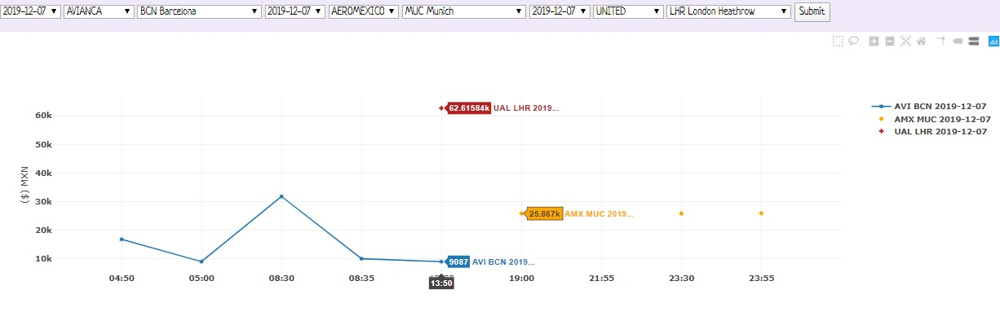
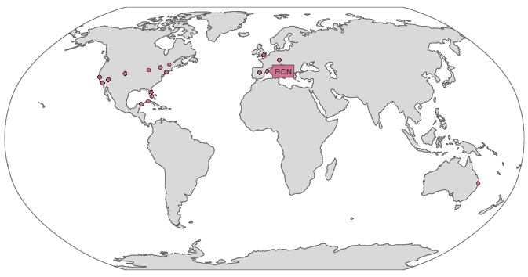
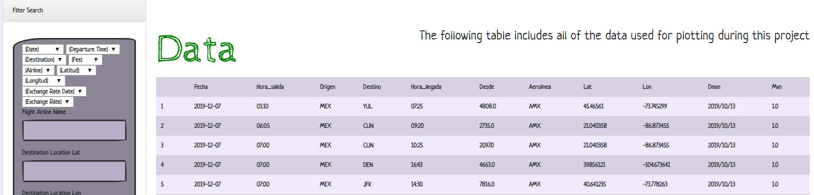
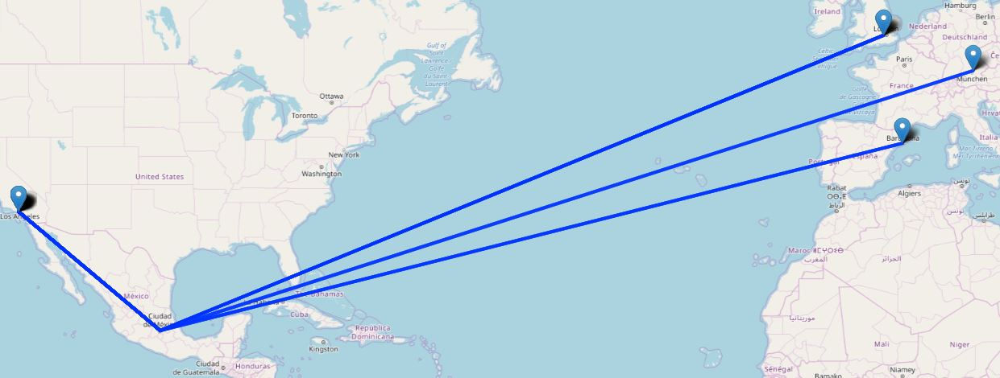

# secondproj_herokuapp_com
### Summary
This repository contains a dashboard that shows the flight information scraped from different websites such as AEROMEXICO, AVIANCA and UNITED AIRLINES on multiples days depending on your chosen. 
For payment methods in US dollars such as UNITED AIRLINES, the exchange rate is taken from Banxico's API on a previous day. 
### Technical Details
In order to run the code, it is required: 
Python, JavaScript, HTML, CSS, Flask and SQLite.  
### Screenshots
PlotlyScatterPlot.jpg 
  
PlotlyWorldMap.jpg 
  
SearchEngine.JPG 
  
LeafletMap.JPG 
  
### Explanations 
The outcome is shown in screenshots for reference purpose of the public. 
# secondproj_herokuapp_com
 The dashboard shows the flight information scraped from different websites on a chosen day. 
 The scatter plot displays a price comparison between airlines whilst the map draws the distance
between destinations for determining the degree to which the two variables&#39; movements are
associated. 
 A search engine breaks down every item in the database such as the most current
exchange rate obtained from the Banxico API. Tools used: Python, JavaScript, HTML, CSS, Flask and
SQLite.
